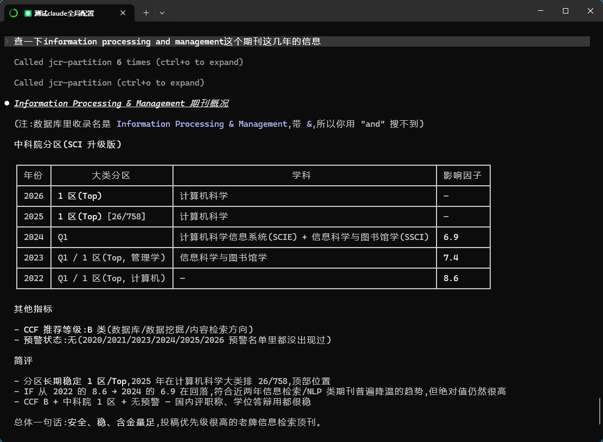

# JCR Partition Table MCP Server

[简体中文](README.md) | **English**

[](https://opensource.org/licenses/MIT)

A Model Context Protocol (MCP) server built on top of data from the ShowJCR repository. It lets any LLM query the latest journal partition / impact factor / warning-list information.



## Features

### 🔧 Tools
- **search_journal** — Look up a journal's impact factor, partition, warning status, etc.
- **get_partition_trends** — Analyse a journal's partition history across years.
- **check_warning_journals** — List international predatory / under-review journals.
- **compare_journals** — Side-by-side comparison of multiple journals.

### 📋 Resources
- **jcr://database-info** — Basic database info and record counts.

### 💡 Prompts
- **journal_analysis_prompt** — A ready-made prompt template for journal analysis.

## Data Sources

All data is sourced from the [ShowJCR](https://github.com/hitfyd/ShowJCR) project, including:

- **Xin-Rui Journal Partition Table** (2026 edition — 22,299 journals + 15 key computer-science conference proceedings; from this edition on, warning info is embedded via the `预警标记: Under Review` field)
- **CAS Advanced Partition Table** (2025, 2023, 2022)
- **JCR Impact Factor** (2024, 2023, 2022)
- **International Predatory Journal Warning List** (2025, 2024, 2023, 2021, 2020 — upstream stopped publishing as a standalone list starting from 2026)
- **CCF Recommended International Academic Conferences & Journals** (2026, 2022)
- **CCF High-Quality Computing Journal Tier List** (2025, 2022)

> **2026 note:** The `check_warning_journals` tool scans both legacy `GJQKYJMD*` warning tables and the embedded `XR2026.预警标记` field, covering both sources.

## Installation

### 1. Requirements
- Python **3.10+** (hard requirement of the `mcp` SDK)
- SQLite3 (bundled with Python on most platforms)

### 2. Install dependencies
```bash
pip install -r requirements.txt
```

### 3. Sync data
Before first run, sync the upstream CSV data into a local SQLite DB:

```bash
python data_sync.py
```

Choose option `1` to sync everything; wait for downloads and import to finish (~20MB, 1–3 minutes).

### 4. Start the server
```bash
python jcr_mcp_server.py
```

> When running as an MCP stdio server, all startup banner output goes to `stderr`, keeping `stdout` clean for JSON-RPC.

## Client Testing

### Standalone smoke test
```bash
python test_client.py
```

Modes:
- Mode 1 — automated full-feature test
- Mode 2 — interactive query shell

### Claude Desktop integration

Add to your Claude Desktop config (`%APPDATA%\Claude\claude_desktop_config.json` on Windows, or `~/Library/Application Support/Claude/claude_desktop_config.json` on macOS):

```json
{
  "mcpServers": {
    "jcr-partition": {
      "command": "/path/to/python",
      "args": ["/path/to/jcr_mcp_server.py"],
      "cwd": "/path/to/project"
    }
  }
}
```

The `claude_desktop_config.json` file in this repo can serve as a reference template.

### Claude Code integration

One-liner via the CLI (scope `user` makes it available across every workspace):

```bash
claude mcp add -s user jcr-partition -- /path/to/python /path/to/jcr_mcp_server.py
```

After registration, run `claude mcp list` — you should see `✓ Connected`.

## Usage Examples

### 1. Search a journal
```python
result = await session.call_tool("search_journal", {
    "journal_name": "Nature"
})
```

### 2. Partition trend analysis
```python
result = await session.call_tool("get_partition_trends", {
    "journal_name": "Science"
})
```

### 3. Compare journals
```python
result = await session.call_tool("compare_journals", {
    "journal_list": "Nature,Science,Cell"
})
```

### 4. Predatory journal check
```python
result = await session.call_tool("check_warning_journals", {
    "keywords": "MDPI"
})
```

## Output Examples

### Journal search
```
📚 Journal: NATURE

[2024] (JCR)
  📊 Impact Factor: 48.5
  🏆 Quartile: Q1
  📖 Category: MULTIDISCIPLINARY SCIENCES(SCIE)

[2025] (CAS Advanced)
  🏆 Partition: 1 [1/118] (Top)
  📖 Category: 综合性期刊 (Multidisciplinary)

[2026] (Xin-Rui Partition Table)
  🏆 Partition: 1 区 (Top)
  📖 Category: 综合性期刊 (Multidisciplinary)
```

### Journal comparison
```
📊 Journal Comparison Result

Journal                   Latest IF        Latest Q        Warning
----------------------------------------
Nature                    64.8             Q1              Normal
Science                   56.9             Q1              Normal
Cell                      64.5             Q1              Normal

💡 Submission suggestions:
  ⭐ Nature: Top-tier journal, highly recommended
  ⭐ Science: Top-tier journal, highly recommended
  ⭐ Cell: Top-tier journal, highly recommended
```

## Architecture

### Data layer
- SQLite stores all partition-table data
- Multi-year historical data side by side
- Automatic data sync + integrity validation

### Service layer
- Built on the FastMCP framework
- Async request handling
- Structured logging and error handling

### Interface layer
- Standard MCP protocol
- Supports tools, resources, and prompts
- Compatible with all MCP clients

## Extending

### Add a new data source
1. Add an entry to the `data_sources` dict in `data_sync.py`
2. Re-run the sync to populate the new table
3. Add a parsing branch in `jcr_mcp_server.py` (`_parse_journal_info`) for the new table prefix

### Add a new tool
1. Decorate a function with `@app.tool()` in `jcr_mcp_server.py`
2. Implement the query logic
3. Provide a docstring — MCP clients surface it as the tool description

### Deploy over HTTP
The server can switch to streamable-HTTP transport for cloud hosting:

```python
app.run(transport="streamable-http", host="0.0.0.0", port=8080)
```

## Links

- [ShowJCR upstream](https://github.com/hitfyd/ShowJCR)
- [MCP official docs](https://modelcontextprotocol.io/)
- [Claude Desktop MCP integration guide](https://claude.ai/docs/mcp)

## License

MIT.

## Contributing

Issues and pull requests are welcome.
